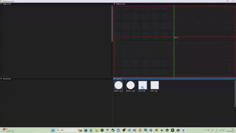
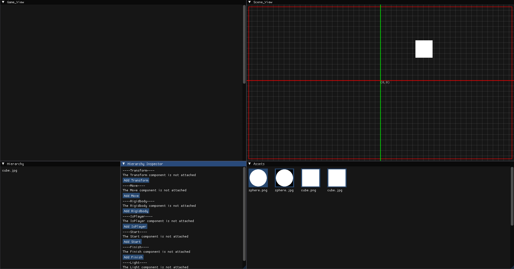
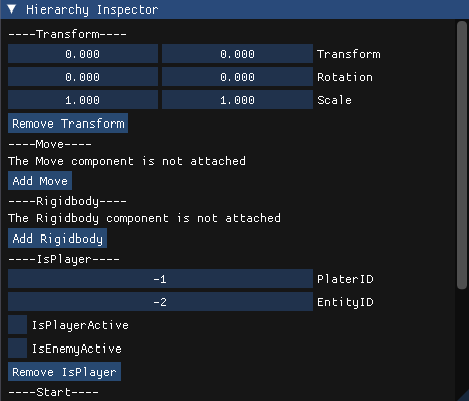
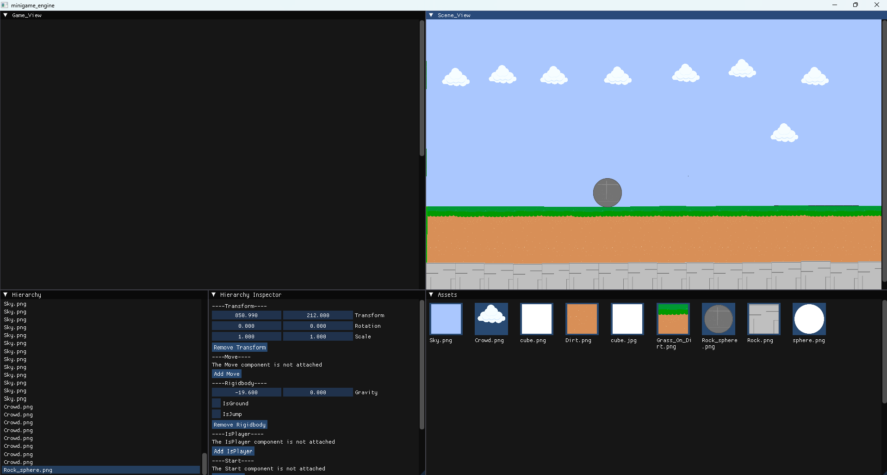
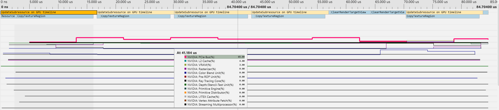

# minigame_engine

## 設計思想
- C++ および Win32 API をベースに、メインウィンドウの生成と、game・scene・input などのサブウィンドウの管理を行うミニゲームエンジンを構築。
- ユーザーはソースコードを記述することなく、シーン上に配置されたオブジェクトに対してキー割り当てを選択することでキャラクターを制御できる。
- 条件分岐や挙動の変化は、Component を追加することで制御可能とし、ノードベースの拡張性ある設計を目指す。
- 誰でも気軽に、快適にゲーム開発を行えるゲームエンジンとして以下の環境を想定  
CPU : AMD Athlon Silver コア数：2コア2スレッドクロック：～3.2GHz程度  
GPU : AMD Radeon Graphics（Athlon内蔵） 
メモリ : 8GB  

### 実際にminigame_engineを用いてゲームを作成する時
- ユーザは「大乱闘スマッシュブラザーズ｣にある｢ステージ作り｣のように、元々ある地形・動くものなどをAssetsウィンドウから選択して、ステージを作成する。
- 空のオブジェクトをステージに置くことで、フラグ設定を行う。
- 各オブジェクトに個別で条件を付けれるようにし、ギミックに自由度を持たせる。

# 開発環境
- C++
- CMake
- Visual Studio 2022
- (メモ書き)コンパイル方法:Windows PowerShell->cmake --build . --config Debug --target run
- Cmake:cmake .. -G "Visual Studio 17 2022" -A x64 

# 開発の流れ
## 初期段階
1. メインループ -> ゲームの時間管理・更新・描画
2. 入力処理 -> 入力イベントの取得・処理
3. 描画処理 -> 画面にオブジェクト生成
4. ウィンドウ管理 -> サブウィンドウの生成・イベント処理

- 現状1 --> 描画されているフレーム数とタイム、文字の表示のみ  

- 現状2 --> ImGuiモジュールを用いたWindow分割(これがWindow_scene{UnityならばHierarchy}などのサブウィンドウになる)  

- 現状3 --> サブウィンドウの描画を行った。 

## 中期以降
5. リソース管理 -> アセットの読み込み・管理
6. シーン管理(ここではwindow_sceneのこと) -> オブジェクトの配置・状態管理

- 現状4 --> リソース管理を完了  

- 現状5 --> Assetをscene上に配置を完了(描画は取り組み中)  

- 現状6 --> オブジェクトの配置完了、座標がオブジェクト固有の座標とシーンの座標とでズレているため見直す必要がある。 

- 現状7 --> アセットオブジェクトの座標処理とwindow_sceneでの座標処理を統一し、不整合を無くした。 
配置されたアセットに対しての個別処理(位置調整/選択/削除)を実装した。 

- 現状8 --> アセットオブジェクトの読み込みを非同期処理(たぶん)に変更し、ヒエラルキーウィンドウにオブジェクト表示/コンポーネントによるインスペクター表示を行った 
  
  

## 終盤
7. 物理演算 -> 衝突判定・力の計算  (ゲームとして違和感ないような物理演算を自動的に行いたい)
8. サウンド管理 -> 効果音・BGMの再生  (エンジン内で音の再生を分かりやすく行いたい)
9. シーケンスの追加 -> プロジェクトの保存とタイトルシーン、ゲームシーン、エンディングシーンなど、各ゲームシーンを生成する
10. 機能のプラグイン化 -> 利用者のPC環境に合わせて必要ない機能を取捨選択できるように

- 現状9 --> 主要Component機能を実装、オブジェクトに付与されたComponentへのKey入力を対応させた。(MoveComponentに関して、上下左右のKey割り当てをできるように)  
  

## 現在取り組み中
- 各Component機能の実装
- window_gameにwindow_sceneに配置されたオブジェクトの投影(実際に出力されるゲーム画面)
- ここまでを区切りに一通りの不具合の解消

## デバック
- 起動直後のフレームでテクスチャ/リソースのアップロード（UpdateSubresource / CopyTextureRegion）が GPU タイムライン上で発生しており、PCIe バス使用率が高い  
- ↑非同期処理にテクスチャの読み込みは変更したハズだが、同じデバック方法が出来ない。

### 予想
- UpdateSubresource / Copy が GPU タイムラインにある → テクスチャやバッファの転送がフレーム中に実行されている  
- PCIe 使用率が高い → CPU→GPU 転送（ホスト→VRAM）がボトルネックになっている  
- GPU のレンダリング（Clear/Draw）は短いが、転送が重い → 転送がレンダリング開始を遅らせている可能性が高い  

### 対策案
- 非同期アップロードを導入する -> Upload Heap（ステージング）に書き込み → CopyCommandList で Copy → CopyQueue に Submit → フェンスで最小限同期  
- GPU 側でミップ生成に切り替える -> CPU でミップを作って転送するのをやめ、GPU の GenerateMips（または Compute）で生成して転送量を削減  

## 更新履歴
2025/08/21 サブウィンドウ関連の煩雑なモジュール群を全て一掃し、簡潔にまとめた 
2025/08/29 ImGuiモジュールによるウィンドウ分割を確認できたので、サブウィンドウ処理の共通化を行った 
2025/09/06 window_sceneに座標系を表示し、window_assetsにテクスチャを表示した 
2025/10/29 Assetをwindow_sceneに配置を行った。描画はまだである。 
2025/11/12 任意のオブジェクトをwidnow_scene上に配置できるようになった。 
2025/12/03 window_sceneに関するAssets処理は大方作り上げた。 
2025/12/20 window_hierarchyとwindow_inspectorの追加、オブジェクトのコンポーネント付加、コンポーネント詳細数値の変更を実装。 
2025/12/29 主要なComponent機能の実装、Key入力の処理を実装。あとは色塗りしたアセット 
