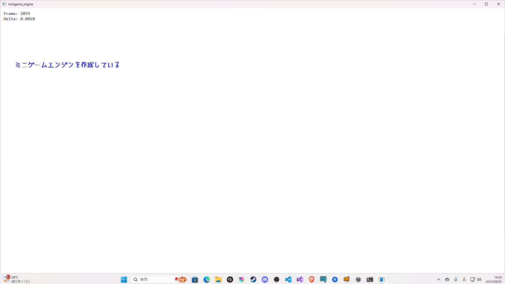

# minigame_engine

## 設計思想
- C++ および Win32 API をベースに、メインウィンドウの生成と、game・scene・input などのサブウィンドウの管理を行うミニゲームエンジンを構築。
- ユーザーはソースコードを記述することなく、シーン上に配置されたオブジェクトに対してキー割り当てを選択することでキャラクターを制御できる。
- 条件分岐や挙動の変化は、Component を追加することで制御可能とし、ノードベースの拡張性ある設計を目指す。

## 構成
- `minigame_engine`: エンジン本体
- `minigame_engine.assets`: アセット管理
- `minigame_engine.game`: ゲームの実装
- `minigame_engine.ui`: UIの実装

## 開発環境
- C++
- CMake
- Visual Studio 2022

## 開発の流れ
# 初期段階
1. メインループ -> ゲームの時間管理・更新・描画
2. 入力処理 -> 入力イベントの取得・処理
3. 描画処理 -> 画面にオブジェクト生成
4. ウィンドウ管理 -> アプリケーションウィンドウの生成・イベント処理

- 現状1 --> 描画されているフレーム数とタイム、文字の表示のみ  

- 現状2 --> ImGuiモジュールを用いたWindow分割(これがWindow_scene{UnityならばHierarchy}などのサブウィンドウになる)  

- 現状3 --> サブウィンドウの描画を行った。 
左下の縦長長方形はInputウィンドウ、右下の横長長方形にはAssetsやhierarchyウィンドウになる。  

# 中期以降
5. リソース管理 -> アセットの読み込み・管理
6. シーン管理 -> オブジェクトの配置・状態管理

# 終盤
7. 物理演算 -> 衝突判定・力の計算  (ゲームとして違和感ないような物理演算を自動的に行いたい)
8. サウンド管理 -> 効果音・BGMの再生  (エンジン内で音の再生を分かりやすく行いたい)

## 現在
- 他サブウィンドウの描画処理を制作中
- ImGuiモジュールによるウィンドウ分割を確認できたので、サブウィンドウ処理の共通化を検討中

## 更新履歴
2025/08/21 サブウィンドウ関連の煩雑なモジュール群を全て一掃し、簡潔にまとめた
